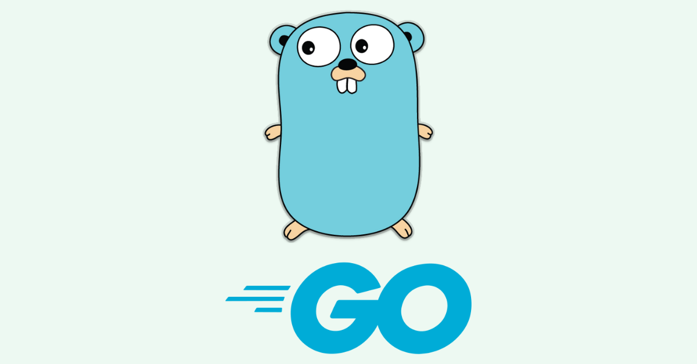

# Go Sample Examples

<p align="center">
    
</p>

### 📖 Information

<ul style="list-style-type:disc">
  <li>This project showcases sample Go applications demonstrating various functionalities, including data processing, web server management, and concurrent programming techniques.</li>
  <li>It is designed to help developers understand Go's syntax, features, and best practices through practical examples.</li>
  <li>The repository includes:
    <ul>
      <li>Examples of basic Go data structures, functions, and interfaces.</li>
      <li>Web server setup using Go's standard library for HTTP handling.</li>
      <li>Concurrency examples using goroutines, channels, and the Go scheduler.</li>
      <li>File handling operations like reading from and writing to files.</li>
      <li>Working with arrays, slices, and maps to demonstrate Go's powerful collection types.</li>
      <li>JSON encoding and decoding examples, including working with custom data structures.</li>
      <li>Error handling following Go idioms to demonstrate best practices for robust programs.</li>
      <li>Usage of Go's testing framework to implement unit and integration tests.</li>
      <li>Practical examples of using Go's `net/http` package for building RESTful web services.</li>
      <li>Basic data parsing, string manipulation, arithmetic operations, and JSON handling in Go.</li>
    </ul>
  </li>
</ul>


### Explore Go Sample Examples

Examples Summary

<table style="width:100%">
  <tr>
      <th>Example</th>
      <th>Description</th>
      <th>Link</th>
  </tr>
  <tr>
      <td>Hello World</td>
      <td>Basic example of printing "Hello, World!" to the console.</td>
      <td><a href="/001_hello_world">001_hello_world</a></td>
  </tr>
  <tr>
      <td>Variables & Types</td>
      <td>Demonstrates variable declaration, initialization, and types.</td>
      <td><a href="/002_variables">002_variables</a></td>
  </tr>
  <tr>
      <td>Control Flow</td>
      <td>Shows usage of for loops, while loops, if-else statements, and switch statements.</td>
      <td><a href="/003_for_while_if_else_switch">003_for_while_if_else_switch</a></td>
  </tr>
  <tr>
      <td>Array, Slice, Range, Map</td>
      <td>Demonstrates array and slice operations, range iteration, and map manipulation.</td>
      <td><a href="/004_array_slice_range_map">004_array_slice_range_map</a></td>
  </tr>
  <tr>
      <td>Functions</td>
      <td>Illustrates basic function usage, variadic functions, closures, and recursion.</td>
      <td><a href="/005_function">005_function</a></td>
  </tr>
  <tr>
      <td>Pointers</td>
      <td>Shows how to use pointers to modify values, structs, slices, and maps. Includes pointer-to-pointer operations.</td>
      <td><a href="/006_pointer">006_pointer</a></td>
  </tr>
  <tr>
      <td>Strings & Runes</td>
      <td>Explains how to manipulate strings and runes, including encoding, slicing, and comparing.</td>
      <td><a href="/007_strings_runes">007_strings_runes</a></td>
  </tr>
</table>


### Technologies

---
- Go 1.23.0


### Prerequisites

Ensure Go is installed on your system
```
    https://golang.org/dl/
```


### Contributors

- [Sercan Noyan Germiyanoğlu](https://github.com/Rapter1990)


